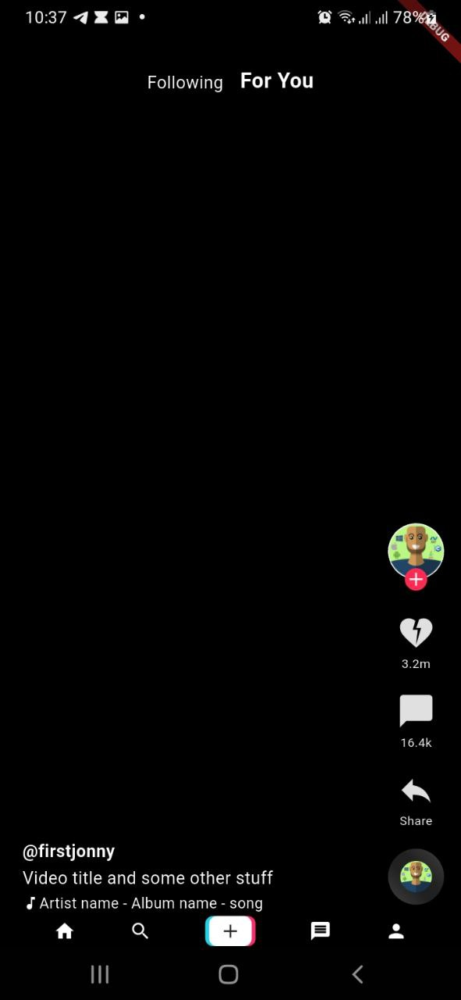

# 📱 TikTok-Style UI in Flutter

This project is a **TikTok-inspired UI** built using **Flutter**. It includes essential UI components such as a bottom navigation bar, action toolbar, video description, and a top section.

---

## 🚀 Features
- **Home Screen** with structured UI components
- **Bottom Toolbar** (Navigation bar with icons)
- **Action Toolbar** (Like, Comment, Share buttons)
- **Video Description Section** (Displays video details)
- **Top Section** ("Following" and "For You")

---

## 📸 Preview


---

## 📂 Project Structure
```
lib/
│-- widgets/
│   ├── bottom_toolbar.dart   # Bottom navigation bar
│   ├── action_toolbar.dart   # Like, comment, share buttons
│   ├── video_description.dart # Video description section
│   ├── top_section.dart      # "Following" & "For You" 
│
│-- main.dart   # Entry point of the Flutter app
│-- home.dart   # Main screen of the UI
│
└── figure/
    ├── ui_preview.png  # UI screenshot for README
```

---

## 🛠 Installation & Usage
1️⃣ **Clone the repository**
```bash
git clone https://github.com/Birkity/flutter_tutorial.git
cd tiktok-ui-flutter
```

2️⃣ **Install dependencies**
```bash
flutter pub get
```

3️⃣ **Run the app**
```bash
flutter run
```

---

## 📌 File Descriptions
### **1️⃣ `bottom_toolbar.dart`**
🔹 **Bottom navigation bar** with home, search, message, and profile icons.

### **2️⃣ `action_toolbar.dart`**
🔹 **Action buttons** (like, comment, share) positioned on the right side of the screen.

### **3️⃣ `video_description.dart`**
🔹 **Displays video details** (username, caption, song info, etc.).

### **4️⃣ `top_section.dart`**
🔹 **Switch between "Following" and "For You"** at the top of the screen.

### **5️⃣ `home.dart`**
🔹 **Combines all components** into a complete TikTok-style UI.

### **6️⃣ `main.dart`**
🔹 **Entry point** of the Flutter app.

---

## 🔗 References
- Flutter Docs: [https://flutter.dev/docs](https://flutter.dev/docs)
- TikTok UI Concept: [TikTok Official](https://www.tiktok.com/)

---

## 📜 License
This project is **open-source** and available under the [MIT License](LICENSE).

---

## 🎯 Future Improvements
✅ Add animations to UI elements  
✅ Implement video scrolling feature  
✅ Improve UI responsiveness  

Feel free to contribute and improve this project! 🚀

